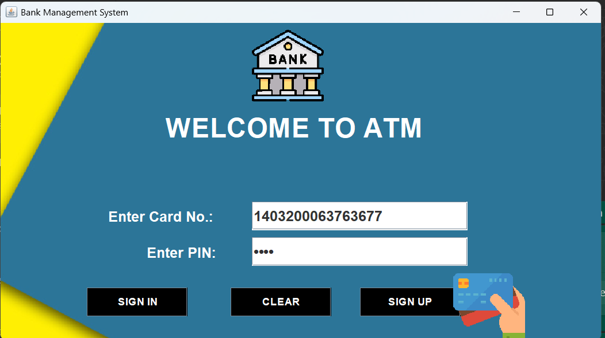
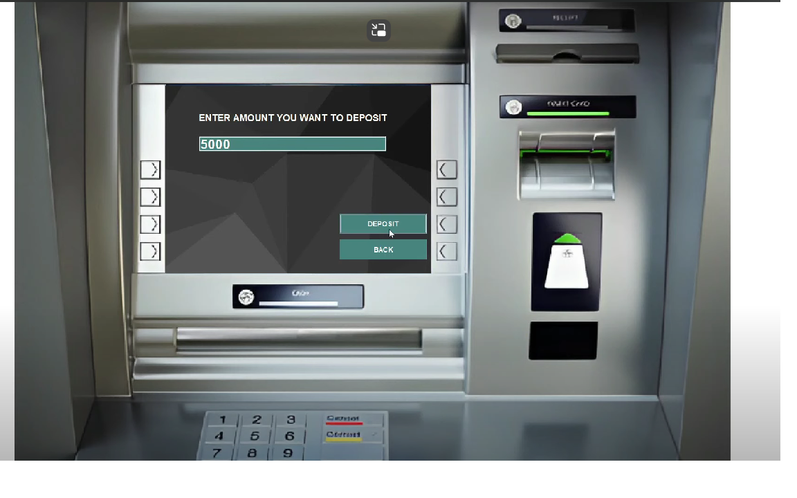

# 🏦 Bank Management System


> A simple yet effective **Bank Management System** built using **Java + MySQL**.  
> It simulates core ATM functionalities including **Login**, **Deposit**, **Withdraw**, and **Balance Inquiry** — designed for learning real-world banking concepts with secure backend logic.

---

## 🖼️ Preview

| Login Screen | Deposit Screen |
|--------------|----------------|
|  |  |

---

## 🚀 Features

🔐 **Secure Login System**  
- User authentication with database validation

💰 **Deposit Functionality**  
- Add money to account securely  
- Input validation to avoid errors

💸 **Withdrawal System**  
- Withdraw amount with balance check  
- Handles insufficient funds scenario

📈 **Balance Inquiry**  
- View current balance in real-time

🗃️ **MySQL Database Integration**  
- All account data and transactions stored in a relational database

🧰 **Simple Console UI / Java GUI**  
- Clean interface for transactions  
- Easy-to-understand flow for beginners

---

## 🔧 Technologies Used

| Tech Stack     | Description                             |
|----------------|-----------------------------------------|
| Java           | Core backend logic & flow               |
| MySQL          | Relational database for accounts        |
| JDBC           | Java-MySQL connectivity driver          |
| (Optional) GUI | Java Swing/JavaFX interface (if used)   |

---

## ⬇️ Download & Run

### 🔗 Clone the Repository

```bash
    git clone https://github.com/manishrnl/Bank_Management_System.git
    cd Bank_Management_System

```


---


🧭 Instructions
Set up MySQL and import the provided SQL script (if included).

Configure your DB credentials inside the Java project.

Compile and run the main Java class (e.g., Main.java).

Use test account credentials or register new users (if supported).

📌 Requirements
✅ Java 11+
✅ MySQL Database
✅ JDBC Driver
✅ IntelliJ IDEA or VS Code

📣 Future Enhancements
💳 ATM card PIN-based login
🧾 Transaction history / mini statement
📧 Email/SMS notifications
📱 Android integration

👨‍💻 Developed By
Manish Kumar
📧 manishrajrnl1@gmail.com
🔗 GitHub Profile

📂 Project Structure
bash
Copy
Edit
📁 Bank_Management_System/
├── 📁 src/
│   ├── 📁 dao/
│   ├── 📁 models/
│   ├── 📁 utils/
│   └── Main.java
├── 📁 resources/
│   ├── 📁 images/
│   └── 📄 config.properties
├── 📁 database/
│   └── bank_management.sql
└── README.md
Let me know if you'd like a GUI
